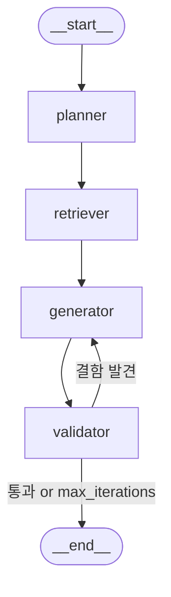

# GraphTrace: AI-Powered Code Traceability & Testing

**GraphTrace**는 자바 소스 코드의 복잡한 호출 구조와 의존성을 Neo4j 그래프 데이터베이스로 시각화하고,  
AI 에이전트(LangGraph)를 통해 코드 변경에 따른 영향 분석 및 맞춤형 통합 테스트 시나리오 생성을 지원하는 **지능형 개발 가이드 시스템**입니다.

👉 **설치 및 프로젝트 구동 방법은 [구동 가이드(GETTING_STARTED.md)](docs/GETTING_STARTED.md)를 참고해 주세요.**

## 🔍 프로젝트 비전 및 주요 기능 (Features)

최신 소프트웨어 개발 환경에서는 비즈니스 로직이 방대해짐에 따라 코드 변경이 어떤 부수 효과(Side Effect)를 가져올지 예측하기 어렵습니다. GraphTrace는 이러한 문제를 해결하기 위해 소스 코드를 그래프의 형태로 해석하고 AI를 결합하여 개발 과정을 보조합니다.

- **Java 소스 코드 구조화**: `.zip` 파일 업로드 시 구조를 자동 분석(AST 파싱)하여 Graph DB에 적재
- **증분 분석 (Incremental Update)**: 파일 해시 기반으로 변경 사항을 감지하여 `NEW`(신규), `MODIFIED`(수정), `DELETED`(삭제) 상태 추적
- **호출 흐름 시각화 (Call Graph)**: 메서드 간 호출 관계 및 API 엔드포인트부터 하위 로직까지 이어지는 전체 연결 시각화
- **AI 테스트 에이전트**: 변경된 코드가 영향을 미치는 범위를 역추적하여, 영향을 받는 API에 대한 맞춤형 통합 테스트 시나리오 자동 생성

---

## 🏗 핵심 아키텍처 1: Graph DB (Neo4j) 구조

이 시스템의 첫 번째 핵심은 코드를 구조화하여 파악할 수 있도록 돕는 그래프 데이터베이스입니다. 코드의 정적 정보와 실행 흐름을 효과적으로 모델링하기 위해 다음과 같은 노드와 엣지로 구성됩니다.

### 🟢 노드 (Nodes) 구성

| 노드 | 설명 | 역할 |
| :--- | :---------------------------------- | :-------------------------------------------------------------------------------- |
| `FILE` | 물리적 소스 코드 파일 | 파일 해시값을 보유하여 코드 변경 감지의 기준점이 됨 |
| `TYPE` | 클래스(Class) 또는 인터페이스 | 객체 지향의 데이터 타입 및 추상화 단위를 표현 |
| `FIELD` | 클래스 내부 멤버 변수 | 클래스 상태를 정의하는 변수 정보 저장 |
| `METHOD` | 함수 / 메서드 | 실제 실행 가능한 최소 단위. 시그니처, 부여된 API 엔드포인트(`@GetMapping` 등) 보관 |
| `PARAMETER` | 메서드 입력 파라미터 | 메서드 호출 인수의 이름 및 타입 정보 보유 |
| `RETURN_VALUE` | 메서드 반환 값 | 메서드 실행 결과의 반환 타입 정보 보유 |

### 🔗 엣지 (Edges) 구성 및 설계 이유

| 관계 유형 | 엣지 방향의 형태 | 설계 목적 및 활용 방식 |
| :-------- | :---------------------------------------------------------------------------- | :------------------------------------------------------------------------------------------------------------------------------- |
| **구조적 계층** | `(FILE)` ➔ `[:CONTAINS]` ➔ `(TYPE)` ➔ `[:CONTAINS]` ➔ `(METHOD)` | 코드의 포함 관계를 명확히 하여, 특정 파일 변경 시 영향을 받는 클래스와 메서드를 신속히 식별 |
| **상세 구조** | `(TYPE)` ➔ `[:HAS_FIELD]` ➔ `(FIELD)`<br>`(METHOD)` ➔ `[:HAS_PARAMETER]` ➔ `(PARAMETER)`<br>`(METHOD)` ➔ `[:HAS_RETURN]` ➔ `(RETURN_VALUE)` | 클래스나 메서드 내부의 상세 요소들을 계층상으로 연결, 변경 분석 시 정교한 문맥 정보 확보 |
| **타입 의존성** | `(FIELD)` ➔ `[:OF_TYPE]` ➔ `(TYPE)`<br>`(PARAMETER)` ➔ `[:OF_TYPE]` ➔ `(TYPE)`<br>`(METHOD)` ➔ `[:RETURNS]` ➔ `(TYPE)` | DTO 등 특정 요소가 의존하는 외부 클래스(타입)를 파악하고, 데이터의 흐름과 형태를 추적 |
| **실행 의존성** | `(METHOD)` ➔ `[:CALLS]` ➔ `(METHOD)` | 순차적·논리적 실행 흐름 연결. 최종 엔드포인트 역추적(Upstream Analysis) 및 세부 실행 흐름 추적(Downstream Analysis) 기능 제공 |

---

## 🤖 핵심 아키텍처 2: LangGraph 기반 AI 에이전트

두 번째 핵심은 Graph DB에 구축된 정밀한 문맥 정보(Context)를 바탕으로 지능적 추론을 수행하는 순환 구조(Cyclic Graph)의 AI 에이전트입니다. 단순한 단방향 텍스트 생성을 넘어, 결과를 스스로 검증하고 보정하는 자가 보정(Self-Correction) 메커니즘을 갖추고 있습니다.

### 전체 에이전트 아키텍처


| 파일 | 역할 | 코드량 |
|:---|:---|:---|
| `integration_agent.py` | LangGraph 핵심 구현 (4노드 순환 그래프) | 507줄 |
| `scenario_agent.py` | 레거시 단순 LLM 호출 에이전트 | 147줄 |
| `entrypoints.py` | LangGraph Studio용 그래프 객체 노출 | 13줄 |
| `queries.py` | Cypher 쿼리 중앙 관리 | 158줄 |
| `agent.py` | FastAPI REST 라우트 | 88줄 |

### 상태 정의 (`IntegrationState`)

```python
class IntegrationState(TypedDict):
    source_method_ids: List[str]      # 입력: 변경된 메서드 ID
    impact_groups: Dict[str, Any]     # Planner 출력
    contexts: Dict[str, Any]          # Retriever 출력
    scenarios: List[Dict[str, Any]]   # Generator 출력
    iterations: int                   # 루프 카운터
    max_iterations: int               # 루프 상한선
    validation_results: List[...]     # Validator 출력
    errors: List[str]                 # 에러 누적
    next_step: str                    # 라우팅 결정 필드
```

> [!TIP]
> `TypedDict` 기반으로 상태 스키마가 **정적으로 명확하게 정의**되어 있어, 각 노드가 읽고 쓰는 필드의 범위를 한눈에 파악할 수 있습니다. `next_step` 필드를 통한 **명시적 라우팅 제어**가 특히 효과적입니다.

### 그래프 구조 (`_build_graph`)


<details>
<summary>📊 Mermaid 다이어그램 코드 보기</summary>



</details>

```python
def _build_graph(self):
    workflow = StateGraph(IntegrationState)

    workflow.add_node("planner", self.planner_node)
    workflow.add_node("retriever", self.retriever_node)
    workflow.add_node("generator", self.generator_node)
    workflow.add_node("validator", self.validator_node)

    workflow.set_entry_point("planner")
    workflow.add_edge("planner", "retriever")        # 선형
    workflow.add_edge("retriever", "generator")      # 선형
    workflow.add_edge("generator", "validator")      # 선형
    
    workflow.add_conditional_edges(                   # 조건부 분기
        "validator", self._should_continue,
        {"generator": "generator", END: END}
    )
    return workflow.compile()
```

> [!IMPORTANT]
> **핵심 — 선형 + 순환 하이브리드 구조**: 
> - `Planner → Retriever`는 **항상 1회만 실행**되는 데이터 수집 파이프라인입니다.
> - `Generator ↔ Validator`만 **선별적으로 반복**하여, 불필요한 DB 재조회 없이 LLM 생성 품질만 반복 개선합니다.
> - 이 설계는 **비용 효율성**(Graph DB 쿼리는 1회)과 **품질 보장**(LLM 출력은 최대 3회 보정)을 동시에 달성합니다.

### 노드별 설계 분석

#### 🔹 Planner Node — 영향 범위 분석

| 분석 항목 | 설명 |
|:---|:---|
| **역할** | 변경된 메서드 → 상위 엔드포인트 역추적 및 그룹화 |
| **DB 쿼리** | `CypherQueries.GET_PATHS_TO_ENDPOINTS` (shortestPath 기반) |
| **엔드포인트 그룹화** | 동일 엔드포인트에 영향을 주는 여러 변경을 `impact_groups` 딕셔너리로 병합 |
| **원인 추적** | `source_methods`, `source_method_names`로 어떤 변경이 원인인지 추적 |

> [!TIP]
> 여러 변경 메서드가 동일 엔드포인트에 영향을 줄 때 **중복 시나리오 생성을 방지**합니다. `set` → `list` 변환으로 JSON 직렬화 호환성도 챙겼습니다.

#### 🔹 Retriever Node — 문맥 수집

| 분석 항목 | 설명 |
|:---|:---|
| **경로 기반 수집** | shortestPath의 모든 노드에서 소스코드·시그니처·반환타입 추출 |
| **1-depth 하위 호출 확장** | 변경 메서드의 직접 하위 호출까지 문맥 확장 (예외 케이스 파악용) |
| **DTO 분류** | **Public DTO** vs **Internal DTO** 자동 분류 |
| **중복 방지** | `processed_signatures` set으로 동일 메서드 중복 수집 방지 |

> [!IMPORTANT]
> **핵심 — DTO 이원 분류 전략**:
> ```python
> # Public: 엔드포인트의 요청/응답에 직접 노출되는 DTO
> # Internal: 내부 로직에서만 사용되는 DTO
> for t_name, fields in all_dtos.items():
>     is_public = any(p in t_name for p in public_dto_names)
> ```
> LLM이 Internal DTO의 필드를 API 응답에 혼입하는 **할루시네이션을 구조적으로 방지**합니다. 프롬프트 레벨이 아닌 **데이터 레벨에서의 제어**라는 점이 효과적입니다.

#### 🔹 Generator Node — 시나리오 생성

| 분석 항목 | 설명 |
|:---|:---|
| **Structured Output** | `with_structured_output(ScenarioOutput)` → Pydantic 모델 기반 타입 안전 출력 |
| **피드백 반영** | 이전 Validator 피드백을 프롬프트에 동적 삽입 |
| **JSON 파싱 방어** | `try/except`로 파싱 실패 시 `{"raw": ...}` fallback |
| **반복 카운터** | `iterations + 1`로 루프 상태 추적 |

> [!TIP]
> **Pydantic 기반 Structured Output**:
> ```python
> class ScenarioOutput(BaseModel):
>     scenario: str          # 마크다운 시나리오
>     expected_result: str   # 기대 결과 (마크다운 테이블)
>     request: RequestDetail # { payload, headers }
>     response: ResponseDetail
> ```
> OpenAI의 `with_structured_output`을 활용해 LLM 출력을 **Pydantic 모델로 강제 구조화**합니다. 이는 단순 JSON 파싱 대비 필드 누락이나 잘못된 타입으로 인한 에러를 **컴파일 타임에 방지**합니다.

> [!NOTE]
> **피드백 루프 연동**: Validator에서 결함이 발견되면, 해당 피드백이 Generator 프롬프트의 `### ⚠️ 이전 검증 피드백` 섹션에 자동 삽입됩니다. LLM이 **구체적인 보정 지침을 받고** 재생성하므로, 단순 재시도 대비 수렴 속도가 빠릅니다.

#### 🔹 Validator Node — 품질 검증

| 분석 항목 | 설명 |
|:---|:---|
| **LLM 기반 검증** | 별도 LLM 호출(`validator_llm`)로 생성 결과를 교차 검증 |
| **검증 기준** | JSON 정합성, 헤더 타당성, Internal DTO 혼입 금지, 추적성, 형식 |
| **종료 조건** | `all_valid == True` (모두 통과) 또는 `iterations >= max_iterations` |
| **Structured Output** | `ValidatorOutput(is_valid, feedback, endpoint)` |

> [!IMPORTANT]
> **핵심 — Generator/Validator LLM 분리**:
> ```python
> self.structured_llm = self.llm.with_structured_output(ScenarioOutput)     # Generator용
> self.validator_llm = self.llm.with_structured_output(ValidatorOutput)     # Validator용
> ```
> 생성과 검증에 **서로 다른 Structured Output 스키마**를 적용하여, 각 역할에 최적화된 출력을 강제합니다. 같은 LLM이지만 역할을 명확히 분리함으로써 **자가 비판(Self-Critique)** 패턴을 구현했습니다.

### 조건부 라우팅 메커니즘

```python
def _should_continue(self, state: IntegrationState):
    if state["next_step"] == END:
        return END
    return "generator"
```

> [!NOTE]
> `next_step` 필드를 통한 **상태 기반 라우팅**. Validator Node에서 결정(`all_valid` or `max_iterations` 도달)하고, `_should_continue`는 단순히 이를 읽어서 전달하는 구조입니다. 라우팅 로직이 Validator에 집중되어 있어 **한 곳에서 종료 조건을 관리**할 수 있습니다.

### 진입점 설계

#### API 진입 (`api/routes/agent.py`)

| 엔드포인트 | 용도 |
|:---|:---|
| `GET /agent/integration-scenario/{method_id}` | 단일 메서드 기반 시나리오 생성 |
| `GET /agent/integration-scenario/batch/all` | 전체 MODIFIED 메서드 일괄 분석 |

#### LangGraph Studio 진입 (`core/agent/entrypoints.py`)

```python
db_client = DBClient()
integration_agent = IntegrationAgent(db_client)
integration_graph = integration_agent.graph  # 컴파일된 그래프 객체 노출
```

> [!TIP]
> `langgraph.json`의 `"integration_agent": "./core/agent/entrypoints.py:integration_graph"` 설정으로 **LangGraph Studio에서 직접 시각적 디버깅**이 가능합니다. 운영 API와 디버깅 도구가 **동일한 그래프 인스턴스**를 참조합니다.