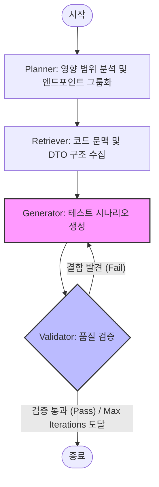

# GraphTrace: AI-Powered Code Traceability & Testing

**GraphTrace**는 자바 소스 코드의 복잡한 호출 구조와 의존성을 Neo4j 그래프 데이터베이스로 시각화하고,  
AI 에이전트(LangGraph)를 통해 코드 변경에 따른 영향 분석 및 맞춤형 통합 테스트 시나리오 생성을 지원하는 **지능형 개발 가이드 시스템**입니다.

## 📦 사전 요구사항 (Prerequisites)
- **Python 3.12+** (패키지 매니저로 `uv` 권장)
- **Node.js 18+** (Frontend 실행용)
- **Neo4j Database** (데이터 저장소)

## 🚀 시작하기 (Getting Started)

### 1. 데이터베이스 준비 (Neo4j)
Neo4j 인스턴스가 실행 중이어야 합니다.

### 2. 프로젝트 설정 (Configuration)
이 프로젝트는 로컬 개발환경(dev)과 운영 환경(prd)을 구분하여 설정 파일을 관리합니다.

#### 환경 설정 파일 준비
프로젝트 루트에 다음 두 파일을 생성해야 합니다.

**1) 로컬 개발용 (.env.dev)**
개인 로컬 Neo4j 및 OpenAI 설정을 입력하세요.
```ini
# .env.dev
NEO4J_URI=bolt://localhost:7687
NEO4J_USER=neo4j
NEO4J_PASSWORD=password

OPENAI_API_KEY=your_openai_api_key_here
LANGSMITH_API_KEY=your_langsmith_api_key_here # Optional
```

**2) 운영/클라우드용 (.env.prd)**
팀원들과 공유된 클라우드 Neo4j 설정을 입력하세요.
```ini
# .env.prd
NEO4J_URI=bolt://<cloud-neo4j-uri>:7687
NEO4J_USER=neo4j
NEO4J_PASSWORD=<secure-password>
```

---

### 3. 백엔드 실행 (Backend)
FastAPI 서버를 실행합니다.

```bash
# 1. 의존성 및 가상환경 동기화 (최초 1회 실행)
uv sync

# 2. 서버 실행
# 개발 환경 (로컬 DB 사용, 기본값)
APP_ENV=dev uv run uvicorn api.main:app --reload

# 운영 환경 (클라우드 DB 사용)
APP_ENV=prd uv run uvicorn api.main:app --reload
```
> **Tip**: `APP_ENV` 변수를 생략하면 기본적으로 `dev` 환경으로 실행됩니다.
- Swagger UI 문서: [http://localhost:8000/docs](http://localhost:8000/docs)

### 4. 프론트엔드 실행 (Frontend)
Next.js 웹 애플리케이션을 실행합니다.

```bash
cd frontend
npm install
npm run dev
```

### 5. LangGraph Studio 실행 (AI Agent Debugger)
에이전트의 사고 과정과 그래프 시각화를 위해 LangGraph Studio 명령어를 사용할 수 있습니다.

```bash
# 1. LangGraph CLI 설치 (최초 1회)
uv add --dev "langgraph-cli[inmem]"

# 2. LangGraph 개발 서버 실행 (.env.dev 사용)
uv run langgraph dev
```
- 실행 후 로그에 출력되는 **Studio UI** URL로 접속하여 에이전트 로직을 인터랙티브하게 테스트할 수 있습니다.
- 사전에 저장된 `.env.dev`의 OpenAI 및 LangSmith 설정을 자동으로 참조합니다.

## 🔍 주요 기능 (Features)
- **Java 소스 분석**: `.zip` 파일 업로드 시 자동 분석 (AST 파싱)
- **증분 분석 (Incremental)**: 변경 사항을 감지하여 `NEW`(신규), `MODIFIED`(수정), `DELETED`(삭제) 상태 표시
- **호출 그래프 (Call Graph)**: 메서드 간 호출 관계 및 API 엔드포인트 연결 시각화
- **AI 테스트 에이전트**: LangGraph를 기반으로 코드 변경에 따른 통합 테스트 시나리오 자동 생성

## 🤖 AI 에이전트 아키텍처 (Agent Architecture)

GraphTrace의 핵심 추론 엔진은 **LangGraph**를 기반으로 설계된 순환 구조(Cyclic Graph) 에이전트입니다. 단순한 단방향 생성을 넘어, 생성된 결과물을 스스로 검증하고 보정하는 자가 보정(Self-Correction) 메커니즘을 갖추고 있습니다.

### 에이전트 워크플로우 (Workflow)


<details>
<summary>📊 Mermaid 다이어그램 코드 보기</summary>



</details>

### 각 노드의 역할
1.  **Planner Node**: 변경된 메서드들로부터 영향을 받는 상위 엔드포인트를 역추적하여 테스트 대상을 그룹화합니다.
2.  **Retriever Node**: 시나리오 생성에 필요한 모든 메서드 소스 코드, DTO 필드 정보, 호출 경로 등의 컨텍스트를 GraphDB에서 수집합니다.
3.  **Generator Node**: 수집된 컨텍스트와 이전 단계의 피드백을 기반으로 마크다운 형식의 시나리오와 JSON 페이로드를 생성합니다.
4.  **Validator Node (New)**: 생성된 결과물의 JSON 유효성, 비즈니스 논리 일관성, 마크다운 형식 준수 여부를 AI가 스스로 검토합니다. 결함 발견 시 구체적인 수정 지침(Feedback)을 생성하여 Generator로 돌려보냅니다.

> [!TIP]
> **자가 보정 루프**는 최대 3회(`max_iterations`)까지 실행되도록 설정되어 있어, 비용 효율적으로 높은 품질의 테스트 시나리오를 보장합니다.

## ✅ 에이전트 로직 검증 (Verification)

에이전트의 복잡한 순환 구조와 자가 보정 로직이 정상적으로 작동하는지 확인하기 위해 별도의 단위 테스트 스크립트를 제공합니다. 이 스크립트는 실제 LLM 비용을 발생시키지 않고 Mock 데이터를 사용하여 흐름을 검증합니다.

### 검증 스크립트 실행
```bash
uv run python scripts/test_integration_loop.py
```

### 주요 검증 항목
- **자가 보정 루프**: 시나리오 생성 실패 시 피드백을 수집하여 다시 생성 단계로 진입하는지 확인합니다.
- **최대 반복 제한**: 지속정인 결함 발생 시 `max_iterations` 설정값에 따라 루프가 안전하게 종료되는지 확인합니다.
- **상태 전파**: 노드 간에 `impact_groups`, `contexts`, `scenarios` 등의 상태 데이터가 누락 없이 전달되는지 검증합니다.